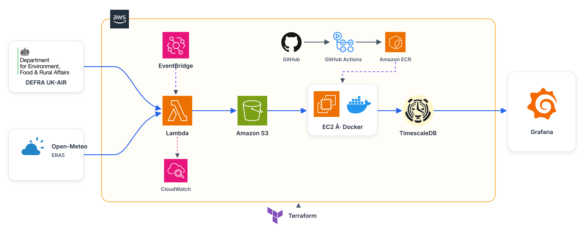
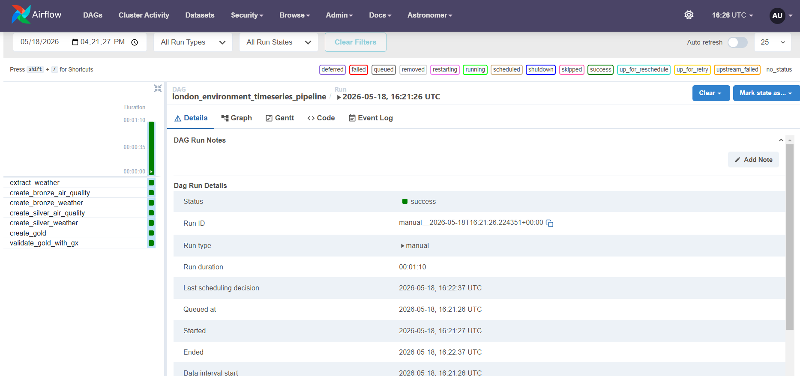

# London Environmental Time-Series Pipeline

An end-to-end data engineering project that combines hourly air-quality and
weather observations for the London Bloomsbury monitoring site. It stores the
source data in AWS S3, transforms it with DuckDB and Parquet, validates the
results with Great Expectations, loads TimescaleDB, and serves a Grafana
dashboard.

The project covers 2022 to the present and is designed so that source ingestion
continues even when the EC2 dashboard host is stopped.


## Current status

Last verified: **31 July 2026**.

| Component | Current state | What that means |
| --- | --- | --- |
| DEFRA ingestion | Deployed and scheduled | A Lambda refreshes the Bloomsbury CSV files in S3 every day at 05:30 Europe/London. |
| Weather ingestion | Deployed and scheduled | A separate Lambda refreshes Open-Meteo ERA5 JSON in S3 every day at 05:20 Europe/London. |
| Raw S3 data | Current | Both sources have yearly objects from 2022 through 2026. |
| EC2 | Running | The existing `t3.small` host is running TimescaleDB and Grafana. |
| Downstream pipeline | Production run verified | The main-branch ECR image completed the full S3-to-Grafana pipeline successfully in 25 seconds. |
| Daily cron | Installed | The guarded pipeline runner executes at 06:00 UTC, writes to `~/pipeline.log` and prevents overlapping runs with `flock`. |
| Tests | Passing | 30 tests pass and the Terraform configuration validates. |

The latest live ingestion checks found:

- DEFRA 2026: 5,064 hourly records through `30-07-2026 24:00:00`.
- Weather 2026: 4,968 hourly records through `2026-07-26T23:00`.

The weather date is intentionally behind the air-quality date because the ERA5
archive is published with an approximate five-day delay.

## Architecture



There are two deliberately separate operating layers:

1. **Always-on source ingestion:** EventBridge Scheduler invokes one Lambda per
   source. The Lambdas validate and write raw files to S3. This layer does not
   depend on EC2.
2. **On-demand processing and serving:** EC2 reads both sources from S3, builds
   the analytical datasets, validates them, loads TimescaleDB and hosts Grafana.
   This layer only runs while EC2 is on.

This separation keeps raw data current without paying to run a server solely
for two small daily downloads.

## Data sources and S3 layout

### DEFRA UK-AIR

The air-quality source is the **London Bloomsbury** monitoring site (`CLL2`). It
contains hourly readings for NO, NO2, NOx, O3, PM10, PM2.5 and SO2.

```text
s3://<bucket>/raw/defra/london_bloomsbury/year=2022/london_bloomsbury_2022.csv
...
s3://<bucket>/raw/defra/london_bloomsbury/year=2026/london_bloomsbury_2026.csv
```

DEFRA can revise provisional readings, so the collector refreshes both the
current and previous calendar year. The pipeline also handles DEFRA's
`24:00:00` timestamp convention by converting it to `00:00:00` on the following
day.

### Open-Meteo ERA5

The weather source uses the exact Bloomsbury coordinates
(`51.522290, -0.125889`) and requests:

- temperature at 2 metres
- relative humidity at 2 metres
- precipitation
- mean sea-level pressure
- wind speed at 10 metres

The collector explicitly selects the ERA5 model and GMT timestamps so the
weather observations align with DEFRA.

```text
s3://<bucket>/raw/open_meteo/year=2022/london_weather_2022.json
...
s3://<bucket>/raw/open_meteo/year=2026/london_weather_2026.json
```

The first weather run backfills from `START_DATE`; later runs refresh the
current and previous year. The current year ends five days before the run date
to account for ERA5 publication lag.

### Safe and repeatable ingestion

Both collectors:

- validate the downloaded structure before writing to S3;
- store one object per source and year;
- record the source URL, fetch time, row count, latest timestamp and SHA-256
  checksum in S3 object metadata;
- skip the upload when validated content has not changed;
- use separate IAM roles, log groups, schedules and CloudWatch error alarms;
- write to a versioned, encrypted and private S3 bucket.

A failure in one source therefore does not prevent the other source from
landing.

## Transformation pipeline

The same ten stages are used by the local Airflow DAG and the lightweight
production runner:

```text
S3 air quality -> bronze air quality -> silver air quality --+
                                                             +-> gold -> validate -> create tables -> load
S3 weather     -> bronze weather     -> silver weather -----+
```

### Bronze

Bronze converts the raw CSV and JSON objects to Parquet while retaining their
source shape. It adds lineage such as `site_name`, `source_year` and
`source_file`.

### Silver

Silver cleans and standardises the observations:

- blank or non-numeric readings become `NULL`;
- invalid negative pollutant readings become `NULL`;
- genuine zero readings remain zero;
- DEFRA `24:00:00` timestamps roll into the following day;
- air-quality columns are reshaped into one row per timestamp and pollutant.

Missing measurements are never replaced with fabricated zeros.

### Gold

Gold creates the datasets consumed by Grafana:

- daily air-quality metrics by pollutant;
- daily weather metrics;
- hourly air quality joined to weather.

### Quality gate and load

Great Expectations checks required columns, null keys, pollutant names,
completeness ranges, expected counts and weather coverage. A validation failure
stops the run before the database load.

TimescaleDB loads use `ON CONFLICT ... DO UPDATE`, making a repeated run safe:
new records are inserted, existing records are refreshed, and duplicates are
not created.

## Ways to run the project

### Lightweight runner

`run_pipeline.py` executes the ten stages in dependency order and exits with a
non-zero status if a stage fails:

```bash
python run_pipeline.py
```

Production uses this runner inside the image built from `Dockerfile.pipeline`.
The cron wrapper uses `flock` to prevent overlapping runs and writes logs to
`~/pipeline.log`.

### Local Airflow

Airflow is retained for development and visual orchestration:

```bash
astro dev start
```

Trigger the `london_environment_timeseries_pipeline` DAG in the Airflow UI. Its
two source branches run independently and meet at the gold transformation.



Airflow is not deployed on the small EC2 host because its scheduler, webserver
and metadata database require substantially more memory than the lightweight
one-shot runner.

## Local setup

### Prerequisites

- Python 3.11 or later
- Docker and Docker Compose
- AWS credentials with read access to the raw S3 bucket
- Astro CLI only if using the Airflow workflow

Create the environment and configuration:

```bash
python -m venv .venv
source .venv/bin/activate          # Windows PowerShell: .venv\Scripts\Activate.ps1
pip install -r requirements.txt
cp .env.example .env
```

Update `.env` with the S3 bucket and database settings. The main configuration
groups are:

| Area | Variables |
| --- | --- |
| AWS and S3 | `AWS_REGION`, `S3_BUCKET`, `S3_RAW_PREFIX`, `DEFRA_SITE_FOLDER`, `WEATHER_SITE_FOLDER` |
| Site and weather | `LATITUDE`, `LONGITUDE`, `START_DATE`, `TIMEZONE` |
| TimescaleDB | `POSTGRES_USER`, `POSTGRES_PASSWORD`, `POSTGRES_DB`, `POSTGRES_HOST`, `POSTGRES_PORT` |
| Grafana | `GF_SECURITY_ADMIN_USER`, `GF_SECURITY_ADMIN_PASSWORD` |
| Production image | `PIPELINE_IMAGE` |

Never commit `.env`. On EC2, leave the AWS access-key variables empty because
the instance role provides S3 access. For local development, boto3 can use your
normal AWS profile or the standard AWS credential variables.

## Tests and validation

```bash
python -m pytest -q
python -m compileall -q dags pipelines src data_quality lambda_src tests
cd terraform
terraform fmt -check
terraform validate
terraform plan
```

Always review a Terraform plan before applying it.

## Deployment and automation

Terraform manages:

- the private, encrypted and versioned S3 bucket;
- both ingestion Lambdas, their least-privilege IAM policies and log groups;
- both EventBridge schedules and CloudWatch error alarms;
- ECR and the GitHub Actions OIDC role;
- EC2, its instance profile, Elastic IP and security group.

GitHub Actions runs tests and builds the production image. OIDC supplies
temporary AWS credentials, so long-lived AWS keys are not stored in GitHub.
Images are pushed to ECR with both `latest` and commit-SHA tags.

### Deployed AWS resources

**DEFRA air-quality ingestion.** EventBridge Scheduler invokes this Lambda
independently to download and validate the London Bloomsbury UK-AIR CSV files
before writing them to the raw S3 prefix.


**Open-Meteo weather ingestion.** A separate scheduled Lambda collects and
validates ERA5 weather observations, keeping a failure or delay in one source
from blocking the other.


**CloudWatch monitoring.** Each ingestion Lambda has its own error alarm. Both
alarms are shown in the healthy `OK` state, meaning no Lambda errors crossed
the configured threshold during the displayed period.


**Container delivery through ECR.** The private ECR repository stores the
production pipeline image with a moving `latest` tag and an immutable
commit-SHA tag. EC2 pulls this image to run the downstream pipeline.


See [`DEPLOY.md`](DEPLOY.md) for the existing ECR, EC2, TimescaleDB and
Grafana deployment guide. The source schedules and their AWS resources are
defined in `terraform/defra_ingestion.tf` and `terraform/weather_ingestion.tf`.

### Important current deployment note

The existing EC2 instance is running, and the current main-branch ECR image has
completed a successful production load. A complete Terraform plan still
contains unrelated EC2 drift and may propose replacing that instance because
of its configured size, AMI or `user_data`. Do not run an unreviewed full
`terraform apply` merely to update ingestion resources. Reconcile the server
drift first, and apply only ingestion targets that have been explicitly
reviewed in a saved Terraform plan.

The one-shot production run and recurring cron installation are verified. The
schedule can be inspected together with its latest output using:

```bash
crontab -l
tail -n 100 ~/pipeline.log
```

## Latest verified production run

On 31 July 2026, the main-branch production image completed all ten stages in
25 seconds. Great Expectations passed for daily air quality, daily weather and
the hourly environment join before TimescaleDB was updated.

| Table | Rows | Grain |
| --- | ---: | --- |
| `daily_air_quality_metrics` | 11,711 | one day and pollutant |
| `daily_weather_metrics` | 1,668 | one day |
| `hourly_environment_metrics` | 280,896 | one timestamp and pollutant joined to weather |

These are the current serving-table counts from that verified run. Missing
source measurements remain SQL `NULL` values rather than being converted to
zero, and the quality gate accepted the observed completeness and join coverage.

## Repository guide

| Path | Purpose |
| --- | --- |
| `lambda_src/` | Independent DEFRA and weather source collectors |
| `pipelines/` | S3 extraction and bronze, silver, gold and database stages |
| `data_quality/` | Great Expectations validation |
| `dags/` | Local Airflow DAG |
| `terraform/` | AWS infrastructure as code |
| `scripts/` | EC2 runner and cron installer |
| `grafana/` | Provisioned datasource and dashboard |
| `.github/workflows/` | CI tests and ECR image build |
| `tests/` | Unit and regression tests |

## Technology choices

| Area | Technology |
| --- | --- |
| Source scheduling | Amazon EventBridge Scheduler |
| Source ingestion | AWS Lambda |
| Raw storage | Amazon S3 |
| Transformation | DuckDB and Parquet |
| Data quality | Great Expectations |
| Serving database | TimescaleDB |
| Dashboard | Grafana |
| Production packaging | Docker and Amazon ECR |
| Local orchestration | Apache Airflow with Astro |
| Infrastructure | Terraform |
| CI/CD | GitHub Actions with AWS OIDC |
| Testing | pytest |

## Known limitations and next steps

- Terraform state is local; a team deployment should use a remote backend with
  locking.
- The EC2 data volumes are tied to the instance; a separate EBS volume with
  snapshots or a managed database would improve recovery.
- Lambda errors have CloudWatch alarms, but the alarms do not yet publish to an
  SNS, email or chat notification target.
- Bronze, silver and gold are rebuilt on EC2 rather than persisted as a data
  lake. That is simple and fast at the current volume but would change at a
  larger scale.
- The downstream cron only runs while EC2 is on. If continuously fresh
  dashboards become a requirement, the serving layer should run continuously
  or move to managed/serverless compute.

## Let's talk data engineering

**Uche Anya**

If you are an engineering manager building dependable data products, or a data
engineer who enjoys debating architecture and trade-offs, I would love to hear
from you. Reach out about opportunities, collaboration, or the decisions behind
this project. 

- Connect with me on [LinkedIn](https://www.linkedin.com/in/uche-anya-0b49a0167)
- Email me at [kingsley_anya@hotmail.com](mailto:kingsley_anya@hotmail.com)
