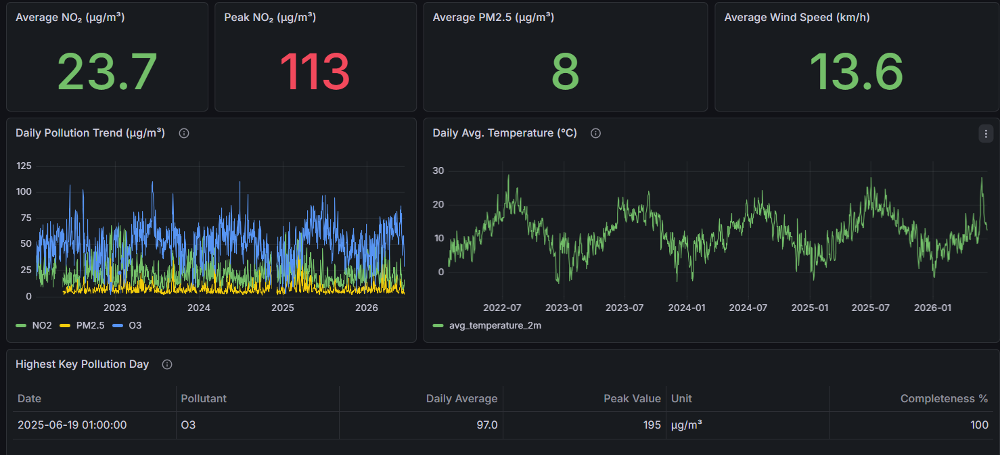

# London Environmental Time-Series Pipeline

A batch data engineering pipeline that pulls London air-quality and weather data from 2022 to the present, cleans it, validates it, and serves it to a Grafana dashboard running on AWS.

Built with S3, DuckDB, Parquet, Great Expectations, TimescaleDB, Grafana, Terraform, Docker and GitHub Actions. It's deployed and running on an EC2 instance inside the AWS free tier, at zero cost.



---

## Status

Deployed and working end to end. A full run takes about **37 seconds** on the deployed instance and lands:

| Table | Rows | What one row is |
| --- | --- | --- |
| `daily_air_quality_metrics` | 11,361 | one day, one pollutant |
| `daily_weather_metrics` | 1,661 | one day |
| `hourly_environment_metrics` | 272,496 | one hour of air quality joined to weather |

All 272,496 hourly rows matched a weather reading, with none unmatched.

The image is built by GitHub Actions and pushed to ECR; the EC2 box pulls and runs it. No AWS access keys exist anywhere in that chain, and nothing gets built on a laptop.

For deploy steps, see [DEPLOY.md](DEPLOY.md).

---

## Data sources

**DEFRA UK-AIR** supplies hourly air quality for the London Bloomsbury monitoring station, covering NO, NO₂, NOx, O₃, PM10, PM2.5 and SO₂. Those CSVs live in S3:

```text
s3://<bucket>/raw/defra/london_bloomsbury/year=2022/london_bloomsbury_2022.csv
...
s3://<bucket>/raw/defra/london_bloomsbury/year=2026/london_bloomsbury_2026.csv
```

**Open-Meteo** supplies historical hourly weather for the same coordinates: temperature, relative humidity, precipitation, mean sea-level pressure and wind speed. Its ERA5 archive publishes on roughly a five-day lag, so the current year is only ever requested up to today's date.

The year range isn't hardcoded. It derives from `START_DATE` and runs to the current calendar year, so 2027 flows in on its own.

---

## How the data moves

```text
raw  →  bronze  →  silver  →  gold  →  quality gate  →  TimescaleDB  →  Grafana
```

**Bronze** converts raw files to Parquet, keeps the original shape, and adds lineage columns (`site_name`, `source_year`, `source_file`). Weather JSON gets flattened to hourly rows here.

**Silver** does the cleaning:

- blank readings become `NULL`
- values that won't parse as numbers become `NULL`
- negative pollutant readings become `NULL`, since negative NO₂ isn't a thing
- a genuine zero stays `0`

DEFRA writes midnight as `24:00` belonging to the previous day, so silver rolls it forward to `00:00` of the next. Air quality also gets pivoted out of DEFRA's wide format into a long one: `recorded_at | site_name | pollutant | value | unit | year | source_file`.

Missing readings never become zero. A gap is honest; a fabricated zero is pollution data that never happened.

**Gold** produces what the dashboard queries: two daily summary tables and the hourly table joining air quality to weather.

---

## Quality gate

Great Expectations validates gold before anything reaches the database. It checks that required columns exist and key fields aren't null, that pollutant names fall in the expected set, that completeness percentages sit between 0 and 100, that valid reading counts never exceed expected counts, and that weather coverage holds on the hourly table.

Row-count expectations derive from the data's own date span rather than fixed numbers, so a new year doesn't break the suite while it still catches missing days or duplicate-row explosions. A failed check stops the run, and nothing loads.

---

## Two ways it runs

**Locally, on Airflow.** `astro dev start` brings up Airflow with the DAG `london_environment_timeseries_pipeline`: ten tasks, with the air-quality and weather branches running independently before converging on the gold build, then validation, table creation and load. Scheduled Monday 06:00, `catchup=False`, one active run at a time.

```text
extract_raw_s3  → bronze_air_quality → silver_air_quality ┐
                                                          ├→ gold → validate → create_tables → load
extract_weather → bronze_weather    → silver_weather     ┘
```

**In production, without Airflow.** `run_pipeline.py` walks those same ten stages in one process and exits non-zero if any of them throws. On the deployed instance a cron entry runs it every Monday at 06:00 UTC, appending output to `~/pipeline.log`.

Both call identical functions. The DAG imports `pipelines.create_gold.main`; so does the runner. There's no second copy of the logic to fall out of sync.

### Why production drops Airflow

Memory, and the cost that follows. The AWS free tier gives a `t3.micro` with 1 GB of RAM, and Airflow's scheduler alone wants roughly that before you add a webserver, its metadata Postgres, TimescaleDB and Grafana. Running it comfortably needs about 4 GB, which means a `t3.medium` at around $30 a month.

I built the full standalone Airflow stack first and got it healthy, so this is a measured decision rather than an assumption. For a weekly batch over a few hundred megabytes, a scheduler running 24/7 is simply the wrong tool. Airflow stays in the repo for local work; the deployed path is lean.

---

## Deployment architecture

```text
GitHub Actions ──(OIDC, no keys)──► ECR ──(instance role)──► EC2 t3.micro
   builds image                   stores image              pulls + runs
                                                                 │
                                                    TimescaleDB + Grafana
```

**GitHub Actions** builds `Dockerfile.pipeline` and pushes to ECR, authenticating through OIDC by assuming an IAM role whose trust policy is pinned to this repository. Images are tagged `latest` and the git SHA, so any running container traces back to a commit.

**EC2** pulls that image using its instance profile, which grants S3 read and ECR pull. The `.env` on the server leaves the AWS key variables blank because boto3 picks the role up from instance metadata.

Building in CI rather than on the box matters: a 1 GB instance compiling a Python image with pandas, pyarrow and Great Expectations is slow and fragile. The production image starts from `python:3.11-slim` and copies only what runs, coming in around 1 GB against the 3.5 GB Airflow-based dev image.

On the box, `docker-compose.prod.yml` keeps TimescaleDB and Grafana up, and runs the pipeline as a one-shot container behind a compose profile so `up` never starts it.

Grafana provisions its datasource and dashboard from files at startup, so a replaced instance comes back with the dashboard already wired rather than needing a manual import.

---

## Incremental and idempotent design

The data has a large frozen tail and a small moving head, and the pipeline is built around that shape.

**Weather** re-fetches the current and previous year on every run, since the current year is still filling in and the previous one can still be revised. Older years are only fetched when their output file is missing.

**DEFRA CSVs** are skipped when the local copy matches the S3 object's size. The growing current-year file changes size and re-downloads on its own. Note that this syncs from S3, not from DEFRA directly, so refreshed source files need uploading to the bucket first.

**Transforms** rebuild bronze through gold from scratch each run. At this volume that costs seconds and eliminates a whole class of incremental-merge bugs.

**Loads** use `ON CONFLICT ... DO UPDATE`. New rows insert, existing rows update, duplicates never appear. The whole run is safe to repeat at any time.

---

## Tech stack

| Area | Tool |
| --- | --- |
| Local orchestration | Apache Airflow (Astro CLI) |
| Production execution | `run_pipeline.py` in a container |
| Raw storage | AWS S3 |
| Transformation | DuckDB |
| File format | Parquet |
| Data quality | Great Expectations |
| Serving layer | TimescaleDB |
| Dashboards | Grafana |
| Image registry | AWS ECR |
| Infrastructure | Terraform |
| CI/CD | GitHub Actions (OIDC) |
| Testing | pytest |

---

## Infrastructure

Terraform provisions the S3 raw bucket (versioned, AES256, public access blocked), the ECR repository with a lifecycle rule expiring untagged images after seven days, the EC2 instance with an Elastic IP, and a security group restricting access to a single allowed IP.

On the IAM side it creates the instance role with S3 read and ECR pull, the GitHub OIDC provider, and a CI role scoped to one repository and one ECR repo.

The instance's `user_data` installs Docker, the AWS CLI and a 2 GB swapfile. Swap earns its place: the run spikes memory during the gold build and the 272k-row load, and 1 GB alone is tight.

Outputs include `ec2_public_ip`, `ecr_repository_url`, `github_actions_role_arn`, `grafana_url` and the bucket name.

---

## Running locally

```bash
astro dev start          # Airflow on :8080, TimescaleDB, Grafana on :3000
# then trigger london_environment_timeseries_pipeline
```

Or skip Airflow entirely and run the same stages directly:

```bash
python run_pipeline.py
```

Tests and checks:

```bash
pytest
python -m compileall dags pipelines src data_quality tests
cd terraform && terraform fmt && terraform validate && terraform plan
```

---

## Deploying

[DEPLOY.md](DEPLOY.md) has the full runbook. The short version: `terraform apply`, set two values in GitHub (a role ARN secret and an ECR URL variable), run the build workflow, then on the box log in to ECR, `up -d`, pull, and run the pipeline once.

---

## Configuration

Copy `.env.example` to `.env` and fill it in. `.env` is gitignored and must never be committed.

Groups: AWS/S3 (`AWS_REGION`, `S3_BUCKET`, `S3_RAW_PREFIX`, `DEFRA_SITE_FOLDER`), location and weather (`LATITUDE`, `LONGITUDE`, `START_DATE`, `TIMEZONE`), TimescaleDB (`POSTGRES_*`), Grafana (`GF_SECURITY_*`), and optionally `PIPELINE_IMAGE` to pull the built image from ECR instead of building locally.

On EC2 the AWS key variables stay empty because the instance role supplies access. Locally they're required, since a laptop has no role to inherit. boto3 needs the exact names `AWS_ACCESS_KEY_ID` and `AWS_SECRET_ACCESS_KEY`.

---

## CI

`.github/workflows/ci.yml` runs on pushes to `dev` and `main` and on PRs into `main`: install dependencies, `compileall` across `dags pipelines src data_quality tests`, then pytest. Current coverage is 17 tests over required-file existence, pollutant cleaning, the dynamic year range and frozen-tail extraction logic, and the silver transforms.

`.github/workflows/build-and-push.yml` handles the image build and ECR push.

---

## Trade-offs and next steps

Scope calls I made on purpose, and what I'd change if this carried real traffic:

- **Terraform state is local.** Fine for one operator; a team needs an S3 backend with DynamoDB locking so two applies can't race each other.
- **Data volumes live on the instance.** Replacing the box means re-running the pipeline to repopulate. A dedicated EBS volume with snapshots, or a managed database, removes that.
- **Monitoring is visible, not pushed.** The dashboard carries a freshness panel showing `MAX(reading_date)` and days-behind per table, so stale data is obvious at a glance. Nothing alerts, though: a failed run still needs someone to look. Wiring the exit code to SNS or Slack is the next step, and I'd alert on freshness rather than on job failure, since a job that never fires produces no failure signal at all.
- **Bronze through gold stay on the instance** rather than persisting to S3 as a lake. At this volume rebuilding costs seconds; at ten times the size I'd write them back.
- **Scheduling is cron, not an orchestrator.** Right for one weekly job; the moment there are several DAGs with real dependencies between them, that argument flips back toward managed Airflow.
- **Source ingestion into S3 is manual.** Everything downstream of the bucket is automated, but new DEFRA files still land there by hand, which is why weather stays current while air quality drifts behind. A scheduled job pulling the current-year file from DEFRA into the bucket, plus moving cron from weekly to daily, would close that loop and hold the dashboard within a day of source. The freshness panel already makes the drift visible, which was the point of building it first.

---

## Contact

### Kingsley Anya

- Email: [kingsley_anya@hotmail.com](mailto:kingsley_anya@hotmail.com)
- LinkedIn: [linkedin.com/in/kingsley-u-anya-0b49a0167](https://www.linkedin.com/in/kingsley-u-anya-0b49a0167)

If you're a recruiter hiring in data engineering, an engineering manager with a team I'd fit, or you've got an idea for a project worth building, I'd like to hear from you. Feedback on the code or the architecture choices is welcome too.
